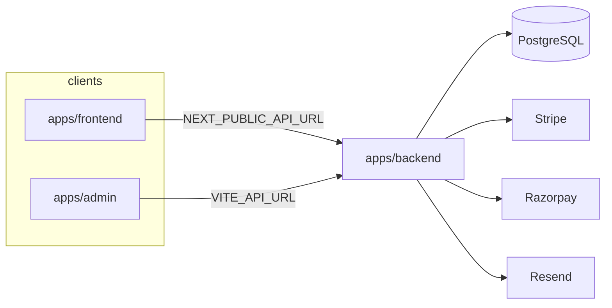

# Tread Trails — Monorepo Migration Plan

**Goal:** Split the monolithic Next.js 14 app into three deployable applications plus shared packages, without losing behavior.

| App | Stack | Responsibility |
|-----|--------|----------------|
| `apps/frontend` | Next.js 14 (App Router) | Customer storefront only |
| `apps/admin` | Vite + React (from `admin panel template/`) | Admin UI only |
| `apps/backend` | Node.js + Express + Prisma | All APIs, auth, payments, email, DB |

---

## Current state (baseline)

| Area | Location | Count |
|------|----------|-------|
| API routes | `app/api/**/route.ts` | **76** |
| Admin pages | `app/admin/**/page.tsx` | **28** |
| Business logic | `lib/**` | ~121 files |
| Admin UI components | `components/admin/**` | Large |
| Prisma | `prisma/schema.prisma` | **25** models |
| Admin template (reference) | `admin panel template/` | Vite + Express demo (Drizzle, not Prisma) |

**Payments:** Stripe webhooks, Razorpay verify/create, Juspay sync  
**Email:** Resend / SendGrid via `lib/email/`  
**Auth:** JWT (`jose`) + `tt_session` cookie, roles `user` \| `admin`

---

## Target architecture

```
tread-trails/                    # pnpm workspace root (legacy Next app here until Phase 5)
├── apps/
│   ├── frontend/                # Storefront Next.js (Phase 5)
│   ├── admin/                   # Vite admin (Phase 6)
│   └── backend/                 # Express API (Phase 1–4)
├── packages/
│   ├── shared-types/
│   ├── shared-utils/
│   └── shared-constants/
├── pnpm-workspace.yaml
└── package.json                 # Orchestration scripts
```

### Request flow (end state)



### API surface (backend)

| Prefix | Source today | Notes |
|--------|----------------|-------|
| `/api/auth/*` | `app/api/auth/*` | Login, signup, logout, me, forgot/reset |
| `/api/products/*` | public + portfolio | Catalog, recommendations |
| `/api/orders/*` | orders + gateways | Checkout, verify, receipt |
| `/api/bookings/*` | bookings | Public + user |
| `/api/builds/*` | builds, portfolio | |
| `/api/brands/*` | brands | |
| `/api/vehicles/*` | vehicles, compatibility | |
| `/api/user/*` | profile, wishlist, etc. | Customer JWT |
| `/api/admin/*` | 41 admin routes | Admin JWT + audit |
| `/api/analytics/*` | admin analytics | |
| `/api/crm/*` | leads, inbox, email | |
| `/api/webhooks/*` | stripe | Raw body, no JSON parser |
| `/api/cron/*` | presence-cleanup | Secret header |
| `/api/track/*` | ping, cart, page | Optional auth |

---

## Layering (backend)

```
src/
├── routes/          # Express routers — map HTTP paths only
├── controllers/     # req/res, status codes, call services
├── services/        # Business rules (from lib/*)
├── repositories/  # Prisma queries (thin)
├── middleware/      # auth, roles, validate, error handler
├── validators/      # Zod (from lib/validations)
├── utils/
└── lib/             # prisma client, stripe, logger adapters
```

**Rule:** Only `apps/backend` imports `@prisma/client`. Frontend and admin use HTTP + shared types only.

---

## Shared packages

| Package | Contents (migrated from) |
|---------|----------------------------|
| `@tread-trails/shared-types` | `data/types.ts`, API DTOs, enums mirroring Prisma |
| `@tread-trails/shared-constants` | `lib/constants.ts`, cookie names, feature flags |
| `@tread-trails/shared-utils` | `cn()`, formatters safe for browser |

**Not shared:** Prisma client, Stripe/Razorpay secrets, Resend keys, server-only `lib/server/*`.

---

## Admin template integration (Phase 6)

**Source:** `admin panel template/` (Vite 5, React 18, shadcn, TanStack Query, HashRouter)

**Strategy:**

1. Copy `client/src/components/ui`, `layout`, `dashboard` patterns into `apps/admin`.
2. Replace demo routes (`/tables`, `/subscriptions`) with Tread Trails routes matching current `app/admin/*`.
3. Add `src/api/` client (axios/fetch) → `VITE_API_URL`.
4. Auth: POST `/api/auth/login` → store JWT (httpOnly via backend Set-Cookie **or** Bearer in memory + refresh; prefer **cookie** parity with today).
5. Route guard: call `GET /api/auth/me` with `role === admin`.
6. Recharts/analytics: wire to `/api/admin/analytics`.
7. Live map: port `presence-map-inner` logic; Leaflet CSS in admin only.
8. **Delete** template Drizzle/Neon — no mock data.

**Route mapping (Next admin → Vite admin):**

| Current | New |
|---------|-----|
| `/admin` | `/` |
| `/admin/orders` | `/orders` |
| `/admin/products` | `/products` |
| `/admin/bookings` | `/bookings` |
| `/admin/builds` | `/builds` |
| `/admin/crm` | `/crm` |
| `/admin/leads` | `/leads` |
| `/admin/analytics` | `/analytics` |
| `/admin/users` | `/users` |
| `/admin/system` | `/system` |
| `/admin/live` | `/live` |
| … | (full table in Phase 6 checklist) |

---

## Frontend migration (Phase 5)

**Keep in `apps/frontend`:**

- `app/` except `app/admin/**` and `app/api/**`
- `components/` except `components/admin/**`
- `contexts/`, `hooks/`, `public/`
- Marketing, cart, checkout, account, auth pages

**Remove:**

- `app/admin/**`, `components/admin/**`
- All `lib/prisma`, `lib/server/*` usage in RSC/pages

**Add:**

```
services/api/client.ts     # fetch wrapper, credentials: 'include'
services/api/auth.ts
services/api/products.ts
hooks/useAuth.ts
```

**Env:** `NEXT_PUBLIC_API_URL=http://localhost:4000`

**SSR:** Server Components call backend with forwarded cookies or use client-side fetch for user-specific data; catalog pages can use ISR + public API.

---

## Authentication design

| Endpoint | Body | Response |
|----------|------|----------|
| `POST /api/auth/login` | email, password | user + Set-Cookie |
| `POST /api/auth/register` | signup fields | user + cookie |
| `POST /api/auth/logout` | — | Clear cookie |
| `POST /api/auth/forgot-password` | email | 202 |
| `POST /api/auth/reset-password` | token, password | 200 |
| `GET /api/auth/me` | — | user or 401 |

**Middleware:**

- `requireAuth` — valid JWT, any role
- `requireAdmin` — role `admin`
- `optionalAuth` — attach user if present

**Cookie:** Keep `tt_session` name for compatibility during strangler period.

---

## Environment variables

| Variable | App |
|----------|-----|
| `DATABASE_URL` | backend only |
| `JWT_SECRET` | backend only |
| `STRIPE_*`, `RAZORPAY_*`, `JUSPAY_*` | backend only |
| `RESEND_API_KEY` | backend only |
| `NEXT_PUBLIC_API_URL` | frontend |
| `VITE_API_URL` | admin |
| `CORS_ORIGINS` | backend |

---

## Phased execution

### Phase 1 — Foundation ✅ (completed)

- [x] `pnpm-workspace.yaml` + root scripts (`dev:backend`, `build:packages`, …)
- [x] `packages/shared-types`, `shared-utils`, `shared-constants`
- [x] `apps/backend` — Express, layered folders, Prisma copy, `GET /health`
- [x] `apps/frontend`, `apps/admin` — README placeholders
- [x] Verified: `npx pnpm@9 install`, package builds, backend health + DB

**Legacy monolith still runs:** `npm run dev` or `npx pnpm@9 dev` at repo root.

**Note:** Install pnpm globally (`corepack enable pnpm`) or use `npx pnpm@9` for workspace commands.

### Phase 2 — Auth + core middleware ✅ (completed)

- [x] Backend: `POST /api/auth/login`, `signup`, `register` (alias), `logout`, `GET /api/auth/me`, `forgot-password`, `reset-password`
- [x] Services: `auth.service.ts` (JWT, bcrypt, Resend reset emails)
- [x] Middleware: `optionalAuth`, `requireAuth`, `requireAdmin`
- [x] Strangler: set `BACKEND_API_URL=http://localhost:4000` in `.env.local` → Next `/api/auth/*` proxies to backend (forwards cookies)
- [ ] Remove legacy inline handlers after cutover (optional; kept as fallback)

**All 76 `/api/*` routes** now call `maybeProxyToBackend` (or `useBackendAuth` for auth) when `BACKEND_API_URL` is set.

### Phase 3 — Public & user APIs ✅ (completed)

- [x] Catalog, portfolio, forms, telemetry (`track/ping`, `track/cart`, `track/page`)
- [x] Orders: create (COD/Stripe/Razorpay/Juspay), `user`, `verify`, `receipt`, `razorpay/verify`, `juspay/sync`
- [x] Bookings: `POST /api/bookings`, `GET /api/bookings/user`
- [x] User: profile, password, wishlist, saved-vehicles, preferences
- [x] `GET /api/products/:slug/recommendations`
- [x] Strangler: `maybeProxyToBackend()` on all storefront `/api/*` routes when `BACKEND_API_URL` is set

### Phase 4 — Admin APIs + webhooks ✅ (completed)

- [x] All `/api/admin/*` (40 route files → Express `apps/backend/src/routes/admin/`)
- [x] `POST /api/webhooks/stripe` (raw body, mounted before `express.json`)
- [x] `GET|POST /api/cron/presence-cleanup`
- [x] Admin libs/services under `apps/backend/src/lib/admin`, `services/admin`
- [x] Strangler proxy on all admin Next routes

### Phase 5 — Frontend split

- `git mv` root Next app → `apps/frontend`
- Strip admin + api routes
- Wire `services/api/*` to backend
- E2E: browse, cart, checkout (test mode)

### Phase 6 — Admin app

- Bootstrap `apps/admin` from template
- Implement all admin screens against Phase 4 APIs
- Deprecate `app/admin` in monolith

### Phase 7 — Cutover & cleanup

- Remove `app/api` from monolith (or delete monolith package)
- Single `pnpm dev` runs frontend + admin + backend (concurrently)
- Production deploy: 3 services / containers
- Update CI: `pnpm build`, lint, test per package

---

## Route migration checklist (76 routes)

<details>
<summary>Admin (41)</summary>

- [ ] GET/POST `/api/admin/analytics`
- [ ] GET `/api/admin/analytics/export`
- [ ] GET `/api/admin/audit`
- [ ] GET/PATCH `/api/admin/bookings`, `/api/admin/bookings/:id`
- [ ] CRUD `/api/admin/brands`, `/api/admin/brands/:id`
- [ ] GET/POST `/api/admin/carts`, POST recover
- [ ] POST `/api/admin/email`
- [ ] GET `/api/admin/errors`
- [ ] CRUD `/api/admin/inbox`, `/api/admin/inbox/:id`
- [ ] CRUD `/api/admin/leads`, email, assignees
- [ ] CRUD `/api/admin/media`, `/api/admin/media/:id`
- [ ] CRUD `/api/admin/orders`, `/api/admin/orders/:id`
- [ ] CRUD `/api/admin/portfolio-builds`
- [ ] GET `/api/admin/presence`
- [ ] CRUD `/api/admin/products`
- [ ] GET `/api/admin/stats`
- [ ] GET `/api/admin/system`
- [ ] POST `/api/admin/upload`
- [ ] CRUD `/api/admin/users`
- [ ] CRUD vehicle-makes, vehicle-models, vehicles, tree, backfill, compatibility

</details>

<details>
<summary>Auth (6)</summary>

- [ ] login, signup, logout, me, forgot-password, reset-password

</details>

<details>
<summary>Storefront + user (29)</summary>

- [ ] bookings, brands, builds, compatibility, contact, corporate-inquiry
- [ ] orders (+ juspay, razorpay, verify, receipt, user)
- [ ] payments/availability, portfolio/*, products, track/*, vehicles
- [ ] user/* (5), webhooks/stripe, cron/presence-cleanup

</details>

---

## Risk register

| Risk | Mitigation |
|------|------------|
| Cookie domain across ports | Dev: explicit CORS + `credentials`, same-site lax; prod: shared parent domain |
| SSR calling API | Server-side fetch with cookie forwarding in `apps/frontend` |
| Webhook raw body | Mount Stripe before `express.json()` |
| Prisma drift (two schemas) | Single source in `apps/backend/prisma` only after Phase 1; root prisma deprecated |
| Long migration | Strangler: proxy from Next API to backend per route group |
| Build break (@vercel/blob) | Fix in backend media service during Phase 4 |

---

## Dev commands (target)

```bash
pnpm install
pnpm dev              # all apps (concurrently)
pnpm dev:backend      # API :4000
pnpm dev:frontend     # Next :3000
pnpm dev:admin        # Vite :5173
pnpm build
pnpm lint
pnpm test
```

---

## Success criteria

1. No Prisma imports in frontend or admin bundles.
2. All 76 API behaviors covered by backend integration tests or manual QA script.
3. Admin panel uses template layout with **live** data.
4. Payments and webhooks work with secrets only on backend.
5. `pnpm build` passes for all workspace packages.

---

*Document version: Phase 1 — monorepo scaffold. Update checklist as phases complete.*
